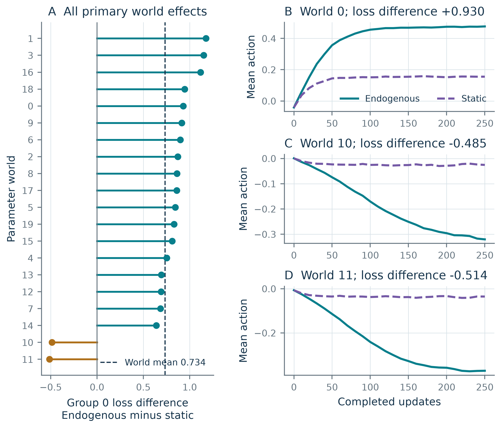

# Feedback selection and local stability in adaptive decision systems

**Current working paper: v0.2.1. Not peer reviewed. arXiv submission is being prepared; no arXiv identifier has been issued.**

This is a reproducible scalar mechanism study with local dynamical analysis and explicitly exploratory sensitivity experiments. It contains no human, biological, clinical or language-model observations.

## Read the revised paper

- [English PDF](v2/manuscript/Feedback_selection_v2.pdf)
- [Editable Word manuscript](v2/manuscript/Feedback_selection_v2.docx)
- [Web-readable full text](v2/manuscript/manuscript.md)
- [Revision materials and reproduction instructions](v2/README.md)
- [Exploratory extension protocol](v2/extension/PROTOCOL.md) and [complete extension results](v2/extension/RESULTS.md)

The revised manuscript has **18 pages, seven figures and twenty references**. Its authors are Lingsen You, Li Shen and Junbo Ge; Li Shen and Junbo Ge are corresponding authors. Historical v0.1.0 retains the earlier title and seven-author byline; see the explicit version note in v2/README.md.

## Findings and scope

The original study's prespecified group-specific average contrast is 0.733772 (95% world-bootstrap interval 0.515809–0.897117). Eighteen of twenty parameter worlds have positive contrasts and two have negative contrasts. The original 7,200 runs are not 7,200 independent environments.

The extension adds 4,500 executed 1,000-update trajectories. A different participation law preserves a positive average but changes magnitude and counterexamples. Equal access does not guarantee a stable central conditional-mean fixed point, and a stable center can coexist with outer stable states. Misspecified correction weights reduce the benefits of ideal probability correction. Learning correction does not automatically correct participant-weighted monitoring.

These conditional results neither discover feedback bias nor establish an AI intelligence ceiling. The motivating retained-knowledge/lost-responsiveness hypothesis remains untested. Known-probability weighting and quotas are reference methods, not new algorithms. Both vascular-background references requested by the authors are retained with their scientific relevance stated; neither validates the simulation's participation assumptions.

## Original reproducibility record

Original code, results, protocol and figure sources remain in the repository root. `study/` is a compatibility snapshot for the frozen extension input paths. The historical [v0.1.0 release](https://github.com/lingsenyou/feedback-circle-study/releases/tag/v0.1.0) remains available. No DOI or peer-review status should be inferred from GitHub publication.

All research data are generated by the released simulation. AI assistance and limitations are disclosed. No additional reuse license is granted in this release.
