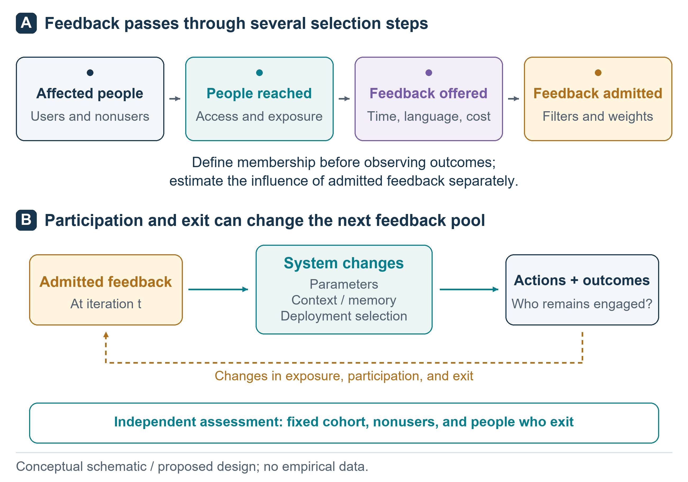
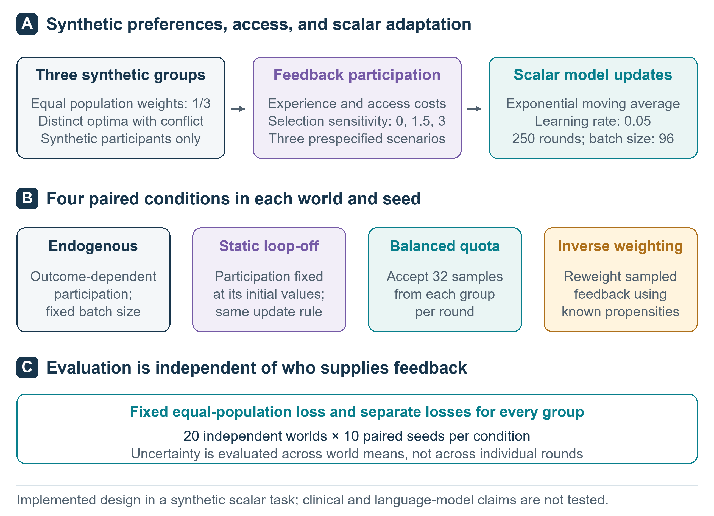
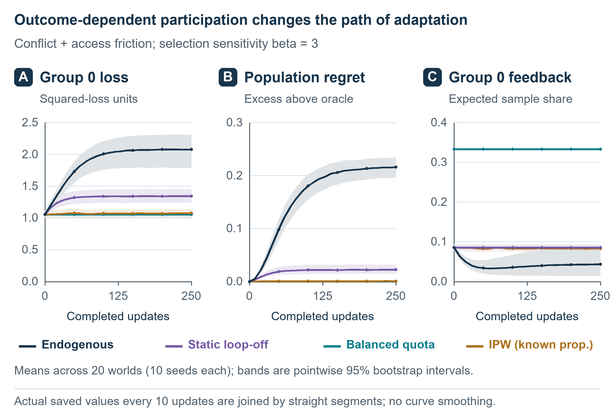
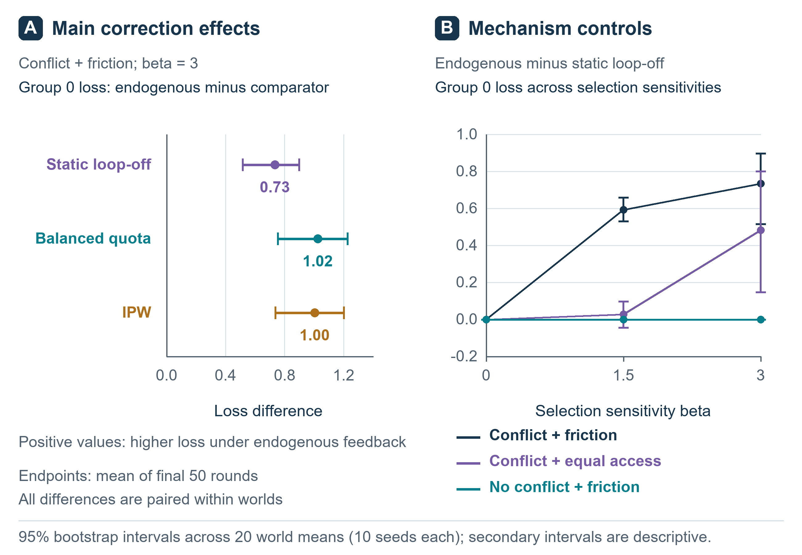

# Selective feedback and stakeholder responsiveness in adaptive decision systems

Lingsen You, Yujun Guo, Wentong Wang, Zisu Peng, Xinyu Zhong, Li Shen, and Junbo Ge

Joint first authors: Lingsen You, Yujun Guo, Wentong Wang, Zisu Peng, and Xinyu Zhong. Corresponding authors: Li Shen and Junbo Ge. Full affiliations and contact details are provided in the PDF and Word manuscript.

## Abstract

As AI systems are repeatedly adapted, the people who supply feedback may become less representative of the people affected by their decisions. We examine this concern through a reproducible mechanism simulation, informed by a broader feedback circle hypothesis. A scalar learner adapts a shared decision to submitted preferences while its declared objective remains the equally weighted population loss. We compared endogenous participation, a static participation control, balanced collection, and correction using known participation probabilities across 20 independently generated parameter worlds, 10 paired random seeds, three strengths of outcome-dependent participation, and three preference and access scenarios. All 7,200 runs were executed. In the primary setting, endogenous participation increased the prespecified low-access group's squared loss relative to the static control by 0.734 (95% world-bootstrap interval 0.516 to 0.897). Mean population regret was 0.215 under endogenous feedback, compared with 0.000808 with probability correction and 0.000004 with balanced collection. With outcome dependence disabled, endogenous and static conditions were identical under paired random draws. Without between-group preference conflict, the endogenous and static action paths also coincided. These results quantify selection effects in the specified learning rule; they do not demonstrate a general developmental limit of AI. Complete preference information was available to the simulator and oracle, rather than learned and retained by an AI model. The study provides an auditable test environment and motivates further experiments separating feedback coverage, knowledge access, and action responsiveness.

Keywords: adaptive decision systems; selective feedback; participation bias; stakeholder responsiveness; simulation; feedback circle hypothesis

## Introduction

A person can know about many lives while receiving consequential correction from relatively few people. Family members, colleagues, clients, and institutional peers can respond repeatedly to that person's decisions. Other people are encountered through descriptions, statistics, or occasional stories. Knowledge about a person's circumstances and a continuing opportunity for that person to change one's next decision are related, but distinct, relationships.

Social mobility makes the distinction intuitively visible. Someone who acquires resources or authority may accurately remember earlier constraints while operating in an environment increasingly shaped by different expectations. This is a motivating thought experiment, not evidence that wealth causes loss of empathy. Mobility may broaden understanding, and persistent relationships may maintain responsiveness across social settings. Nor is similarity inherently harmful: experimental work has shown that homophilous connections can facilitate adoption of a health behaviour.[1]

For AI, the structural question concerns the relationship between the population affected by a system and the participants whose feedback enters its adaptation. We call the latter its feedback circle, defined through participation, acceptance, and weighting rules during a specified period. Membership is not inferred retrospectively from favourable outcomes. The feedback circle hypothesis proposes that concentration of opportunities for correction can undermine responsiveness to less represented stakeholders when a system has explicit responsibilities to multiple groups.

This problem has important precedents. Hashimoto and colleagues studied how performance-dependent retention can amplify representation disparity under repeated loss minimization, and developed a distributionally robust response.[2] Performative prediction formalizes how model decisions can change the distributions encountered in subsequent learning.[3] We do not claim to discover either feedback loops or representation disparity. Our contribution is a small, transparent simulation that contrasts static selection, outcome-dependent selection, and two corrective procedures under a fixed population objective. We then clarify the additional evidence required to test a stronger separation between what a model knows and how it acts.

Figure 1. The conceptual feedback circle. Participation can be filtered through access, submission, and acceptance before influencing system change. Outcomes may affect subsequent participation. The schematic motivates the study but is broader than the implemented model, which represents group-level participation probabilities and a scalar decision update. It contains no measured values.

## Related research and the scope of the hypothesis

Feedback training necessarily involves particular evaluators. The InstructGPT report distinguished its labelers, researchers, and API customers from the wider population affected by model behaviour.[4] Language model opinion evaluations have also found uneven alignment with demographic groups represented in US polling data.[5] These findings motivate attention to representation but do not, by themselves, identify a longitudinal feedback mechanism.

Sycophancy research shows how evaluator approval can diverge from reliable assistance.[6] Research on preference collapse and MaxMin-RLHF further demonstrates why diverse collected feedback need not translate into a plural objective.[7,8] These are established concerns. Our simulation uses neither RLHF nor a language model, and the corrective methods tested here are not proposed as new alignment algorithms.

The stronger feedback circle hypothesis would predict that decision-relevant factual knowledge and preference prediction remain intact while action responsiveness deteriorates for a poorly represented group. Catastrophic forgetting is an alternative explanation that such a study must distinguish.[9] An oracle information table cannot establish learned knowledge retention. Similarly, conventions in interacting language model populations and collapse during recursive training concern different mechanisms and should not be treated as direct evidence for the present hypothesis.[10,11]

The current study addresses a narrower question: under a fixed population objective, how does a simple learner behave when submitted feedback depends on its previous action? It is a computational mechanism study. It contains no human observations, biological measurements, clinical outcomes, or language model evaluations.

## Methods

### Population objective and preference worlds

The population comprises three equally weighted fictional groups, numbered 0, 1, and 2. In the conflicting-preference scenarios, each world's group means are theta = (-1, 0, 1) plus independent uniform perturbations between -0.15 and 0.15. Individual submitted preferences are y = theta_g + epsilon, where epsilon is independently uniform between -0.2 and 0.2. These quantities are dimensionless preference coordinates, not measurements of income, empathy, health, or social class. In the no-conflict scenario, all three groups share the same preference mean.

The action w is a single shared continuous decision. Expected group loss is L_g(w) = (w - theta_g)^2 + 0.2^2/3. The declared service objective is the equally weighted mean J(w) = [L_0(w) + L_1(w) + L_2(w)]/3, which remains fixed throughout all evaluations. Its optimum is w* = mean(theta), and population regret is J(w) - J(w*) = (w - w*)^2. Every learner starts at w*. This initialization deliberately isolates deviation from an initially population-optimal action. It does not model the acquisition of general intelligence.

Twenty independently generated parameter worlds were used. Each world had 10 paired feedback-noise seeds. The worlds vary preference means within the same simple family; they are not 20 substantively different real environments. The exact configuration, world parameters, seeds, and outputs are supplied with the code.

### Participation and adaptation

Before each update, group g has feedback participation probability pi_g = 0.02 + 0.96 sigmoid[2 - c_g - beta L_g(w)]. The lower and upper bounds preserve positive participation. The access-friction vector is c = (1.2, 0, 0) in the main and no-conflict scenarios, making group 0 the prespecified low-access group. The equal-access scenario sets all friction values to zero. Beta takes values 0, 1.5, and 3. Larger beta makes participation more sensitive to preceding loss. This response function is a modelling assumption, not an estimated human behavioural law.

Because groups have equal population weights, feedback group probabilities are proportional to pi_g. Each update uses 96 accepted preferences. The uncorrected learner updates w to 0.95 w + 0.05 mean(y). There are 250 updates per run. Random draws for group selection and preference noise are paired across conditions within each world and seed. No parameters were selected to maximize the final reported effect.

### Experimental conditions

Four conditions are compared in Figure 2. Endogenous feedback recomputes participation probabilities from the current action before every update. Static feedback freezes participation probabilities at the initial population-optimal action, thereby retaining baseline selection while disabling its dependence on subsequent outcomes. Balanced collection uses exactly 32 feedback samples from each group per update. Inverse-probability correction uses endogenous participation but replaces the ordinary batch mean with sum(y_i/pi_gi)/sum(1/pi_gi). This self-normalized estimator uses the true probabilities supplied by the simulator; estimation error and unobserved selection are not studied.

All conditions use the same number of accepted feedback items and action updates. Balanced collection may require additional recruitment effort, and probability correction requires information that a deployed system may not possess. Equal accepted-feedback budgets therefore do not establish equal acquisition costs. The complete-information oracle w* is an analytic reference, not a trained model or an additional stochastic condition.

The full design contains 20 worlds x 10 seeds x 3 beta values x 3 scenarios x 4 conditions = 7,200 runs. There are no model-capacity comparisons, knowledge replay experiments, or human participant groups in this completed design. Those elements belonged to the broader proposed research programme and remain future work.

Figure 2. Executed simulation design. Four adaptation conditions share a fixed three-group population objective, initial action, accepted-feedback budget, and update count. Three participation strengths and three preference/access scenarios provide controls. The 7,200 runs use 20 independently generated parameter worlds, with 10 paired random seeds per world. Balanced collection does not imply equal recruitment costs; inverse-probability correction assumes known selection probabilities.

### Outcomes and analysis

The primary comparison is group 0 expected squared loss under endogenous versus static feedback in the main scenario at beta = 3, averaged over the final 50 decision rounds before updating. A positive difference indicates worse service to this prespecified group. Secondary summaries include population regret, every group's loss, group 0 feedback share, and the fixed-population loss minus the loss weighted by current feedback probabilities. Lower loss is better. The feedback-weighted metric is an expectation under the simulator, rather than a survey of actual people.

Seed-level endpoints are first averaged within each world. Uncertainty intervals are obtained by paired bootstrap resampling of the 20 worlds, with 10,000 resamples. These intervals describe variation over the specified parameter-world distribution; they do not justify extrapolation to other model families or populations. Multiple secondary comparisons are descriptive, without confirmatory multiplicity-adjusted claims. Iteration checkpoints and individual feedback records are not treated as independent experimental units.

The analysis plan, configuration, and their hashes were saved locally before the main run. This was not an external preregistration. The code records execution metadata, invariant checks, and all run-level summaries. Conditions with beta = 0 provide an exact implementation check because the endogenous and static probability schedules should coincide. A separate replay check examines whether the realized batch sequence reproduces the same action trajectory.

## Results

### Executed runs and primary comparison

All 7,200 planned runs completed across 36 condition cells. Each run contained 250 updates and 96 accepted synthetic preferences per update. The design therefore processed 172.8 million synthetic feedback uses; paired conditions reused random draws, so these are not independent observations. The 20 worlds are the bootstrap units. Probability normalization, risk decomposition, quota counts, zero-beta equivalence, and exact replay checks passed. The maximum discrepancy in the analytic risk decomposition was 5.16e-16. No failed runs were removed.

In the main scenario at beta = 3, mean group 0 loss was 2.078 under endogenous feedback and 1.345 under static feedback. The primary paired difference was 0.734 (95% interval 0.516 to 0.897) squared preference units. Group 0's mean accepted-feedback share was 4.33% under endogenous feedback and 8.62% under the static control, compared with its fixed population share of 33.33%. Figure 3 shows the corresponding evolution rather than only the final endpoint.

Figure 3. Observed simulation trajectories in the main scenario at beta = 3. Curves and uncertainty summaries are calculated from the executed runs, with seeds averaged within each world. Population regret is measured against the fixed equal-population oracle, and group 0 is designated by its access-friction parameter before observing outcomes. These are synthetic computational results, not observations from a language model or human population.

### Corrections and monitoring bias

Mean population regret in the primary setting was 0.215062 for endogenous feedback, 0.022380 for static feedback, 0.000004 for balanced collection, and 0.000808 for probability correction. Group 0 loss under the two corrective conditions was 1.055 and 1.075, respectively. The self-normalized correction did not exactly match the quota condition: its paired group 0 loss difference was 0.021 (95% interval 0.013 to 0.029). Correcting the fixed-population objective also changed the distribution of losses across other groups; Table 1 reports all three, rather than presenting group 0 alone.

The expected monitoring gap, defined as fixed-population loss minus feedback-weighted loss, was 0.640 under endogenous feedback and 0.433 under static feedback. A positive gap means that evaluation weighted like incoming feedback portrays lower loss than evaluation of the fixed population. The gap remained 0.389 after probability-corrected learning if monitoring itself was left uncorrected. The quota gap is zero by construction because feedback and population weights coincide. Expected invitations per accepted item were 1.99, 2.45, 5.10, and 2.43 for endogenous, static, quota, and corrected conditions, respectively. These are model-derived collection costs, not observed recruitment costs.

| Condition | Group 0 loss | Group 1 loss | Group 2 loss | Population regret | Group 0 share |
| --- | --- | --- | --- | --- | --- |
| Endogenous | 2.078 | 0.204 | 0.472 | 0.215062 | 4.33% |
| Static | 1.345 | 0.028 | 0.803 | 0.022380 | 8.62% |
| Balanced quota | 1.055 | 0.017 | 1.037 | 0.000004 | 33.33% |
| Probability correction | 1.075 | 0.017 | 1.019 | 0.000808 | 8.32% |

Table 1. Main-scenario outcomes at beta = 3, averaged over the final 50 decision rounds before updating. Values are means across 20 worlds after averaging 10 paired seeds per world. Population regret is measured against the equal-population optimum. Group 0 feedback share is a proportion of accepted feedback. Uncertainty for the primary paired comparison is reported in the text.

### Controls and boundaries

At beta = 0, endogenous and static endpoints were exactly identical under the paired draws in all scenarios. Without between-group preference conflict, their action paths were identical at every beta: group selection no longer changed the preference values used in a paired update. These exact identities validate the implementation and expose structural boundary conditions; they are not independent empirical discoveries. In the main scenario at beta = 1.5, the endogenous-minus-static group 0 loss difference was 0.593 (95% interval 0.530 to 0.659). With equal access friction, the same reference-group contrast was 0.027 (95% interval -0.045 to 0.097) at beta = 1.5 and 0.482 (95% interval 0.147 to 0.800) at beta = 3. Group 0 has no special access disadvantage in that scenario, and these estimates must not be interpreted as an intrinsic property of its label. Complete group and world summaries are retained in the repository. Replaying one saved endogenous feedback sequence reproduced its original action trajectory with zero numerical discrepancy; the replay checks determinism conditional on the realized sequence, not a separate feedback mechanism.

Figure 4. Effects across participation strengths and control scenarios. Summaries use actual run outputs and world-level comparisons. Intervals show uncertainty across the 20 sampled parameter worlds, not across 7,200 independent real environments. Secondary comparisons are descriptive. The no-conflict and zero-outcome-dependence conditions test boundaries of the proposed mechanism.

## Discussion

### What the experiment establishes

The study measures how a specified feedback-selection process interacts with an equally specified learning rule. It reproduces a concern already present in research on representation disparity and performative learning: optimizing feedback from current participants can diverge from a fixed population objective.[2,3] The contribution is a transparent implementation, a paired comparison against static selection, and explicit boundary and correction conditions. A large number of random-seed runs should not be mistaken for a large range of mechanisms.

The result is conditional on conflicting preferences, the participation function, shared action, and updating rule. Changing the feedback distribution changes the learner's effective optimization target. That relationship follows from the model's structure; the measured results quantify its consequences under the declared parameters rather than discovering a universal law. The static control helps distinguish baseline access imbalance from amplification during adaptation. It does not prove that all differences in deployed AI arise through this mechanism.

Both corrective procedures substantially reduced population regret in the primary setting. This finding supports an explanation involving feedback selection and the estimating rule, rather than an unavoidable limit on intelligence. It also illustrates why improving the decision rule and improving the monitoring population are separate tasks: unweighted feedback monitoring remained biased even when learning used probability correction. The corrections depend on assumptions, including group access or known selection probabilities, and should not be presented as cost-free solutions for deployed systems.

### What remains untested about knowledge and action

The simulator knows every group's preference distribution, and the oracle acts on that information. The adaptive learner updates a scalar estimate from sampled preferences. These are different computational objects. We did not train a shared model to learn facts, predict preferences, and act, and did not measure retention of learned knowledge. Consequently, the simulation cannot substantiate the stronger claim that an AI understands an underserved group while losing responsiveness to it.

A stronger test would use matched held-out situations for factual prediction, preference prediction, and action. Retention would need prespecified equivalence bounds; an action deficit would need a practically relevant threshold. Providing correct decision-relevant information at action time would test information access. Knowledge replay would need matched-supervision controls. A shared decision pathway would help exclude an architectural separation introduced by independent prediction and action modules. Contrary findings, including restoration by knowledge access alone, would narrow the stronger hypothesis.

We also did not test social transition histories or increasing model capacity. Ordinary recency weighting can make an adaptive scalar learner sensitive to example order; that alone would not demonstrate an analogue of human social mobility. Likewise, observed conventions among interacting language models do not make multiple agents validated representatives of human communities.[10] Distinct prompts are insufficient evidence of distinct opportunities for affected people to correct a system.

### Implications for panvascular research

The potential application is a research governance question. Work on intelligent photonics and digital twins connects imaging, computational representations, and adaptive vascular care.[12] AI-assisted generation and screening of PLLA modifiers illustrates another stage at which computational objectives enter vascular device research.[13] Both articles are listed on lingsenyou.com. They motivate this application context; neither supplies evidence for the present simulation or its behavioural assumptions.

As a tool's intended use expands, the people able to correct its objectives may need to expand as well. A materials-screening system can legitimately prioritize defined technical criteria. A system that later influences patient options or follow-up arrangements has additional responsibilities. Feedback concentrated in well resourced centres might overlook implementation constraints elsewhere, but that possibility requires direct assessment using appropriate clinical and operational evidence.

The present scalar preference coordinate has no validated mapping to vascular disease, treatment, or patient benefit. We therefore make no clinical recommendation and claim no biological finding. A future biological application would require a substantive biological question, suitable data, and independent validation, rather than relabelling the present abstract groups as patients.

### Limitations

The model has three groups, one action dimension, bounded uniform preference noise, a known outcome-dependent participation function, and an initially optimal action. Groups have fixed means and equal population weights. Group identities and true sampling probabilities are available for correction. These assumptions omit uncertain population membership, imperfect feedback, changing needs, strategic evaluators, unequal exposure to consequences, and the complexity of foundation-model training. Balanced collection assumes that enough feedback can be obtained from each group. The self-normalized weighting estimator also introduces finite-sample behaviour that need not match its large-sample target exactly.

World-bootstrap intervals capture limited parameter variation and simulation noise. They do not estimate uncertainty about whether the model accurately represents a deployed system. No patient data, survey data, biological measurements, or foundation-model outputs were used. The analysis was locally specified before execution but not externally preregistered, and the work has not undergone peer review.

## Conclusions

Selective feedback can be studied without assuming that AI has human feelings or follows human developmental stages. Our computational experiment makes the service population, participation mechanism, updating rule, and correction conditions explicit. Its results concern those mechanisms within a small synthetic environment. The broader question remains whether more capable AI systems retain meaningful opportunities for affected people to correct their decisions as their sphere of influence expands.

## Data and code availability

The protocol, configuration, simulation and analysis code, complete run-level summaries, world-level outputs, figure sources, and manuscript are available in the accompanying repository: https://github.com/lingsenyou/feedback-circle-study. All observations in the experiment are generated by the released simulation. No private human or clinical data are included. The repository provides reproduction commands and software versions.

## Use of generative AI

OpenAI Codex assisted with literature retrieval and organization, manuscript drafting and English adaptation, development and execution of simulation and analysis code, critical review, and preparation of figures. The reported numerical results were calculated by executing the released code; they were not supplied as invented example values. AI assistance does not replace independent scientific review or external validation.

## Competing interests

Lingsen You, Li Shen, and Junbo Ge have participated in development of the XINSORB bioresorbable scaffold. This study does not evaluate XINSORB or any vascular device.

## References

[1] Centola D. An experimental study of homophily in the adoption of health behavior. Science. 2011;334(6060):1269-1272. https://doi.org/10.1126/science.1207055

[2] Hashimoto T, Srivastava M, Namkoong H, Liang P. Fairness Without Demographics in Repeated Loss Minimization. Proceedings of the 35th International Conference on Machine Learning. PMLR. 2018;80:1929-1938. https://proceedings.mlr.press/v80/hashimoto18a.html

[3] Perdomo J, Zrnic T, Mendler-Dunner C, Hardt M. Performative Prediction. Proceedings of the 37th International Conference on Machine Learning. PMLR. 2020;119:7599-7609. https://proceedings.mlr.press/v119/perdomo20a.html

[4] Ouyang L, Wu J, Jiang X, et al. Training language models to follow instructions with human feedback. Advances in Neural Information Processing Systems. 2022;35:27730-27744. https://arxiv.org/abs/2203.02155

[5] Santurkar S, Durmus E, Ladhak F, Lee C, Liang P, Hashimoto T. Whose Opinions Do Language Models Reflect? Proceedings of the 40th International Conference on Machine Learning. PMLR. 2023;202:29971-30004. https://proceedings.mlr.press/v202/santurkar23a.html

[6] Sharma M, Tong M, Korbak T, et al. Towards Understanding Sycophancy in Language Models. International Conference on Learning Representations. 2024. https://openreview.net/forum?id=tvhaxkMKAn

[7] Xiao J, Li Z, Xie X, et al. On the Algorithmic Bias of Aligning Large Language Models with RLHF: Preference Collapse and Matching Regularization. arXiv preprint. 2024; revised 2025. https://arxiv.org/abs/2405.16455v2

[8] Chakraborty S, Qiu J, Yuan H, et al. MaxMin-RLHF: Alignment with Diverse Human Preferences. Proceedings of the 41st International Conference on Machine Learning. PMLR. 2024;235:6116-6135. https://proceedings.mlr.press/v235/chakraborty24b.html

[9] Kirkpatrick J, Pascanu R, Rabinowitz N, et al. Overcoming catastrophic forgetting in neural networks. Proceedings of the National Academy of Sciences. 2017;114(13):3521-3526. https://doi.org/10.1073/pnas.1611835114

[10] Ashery AF, Aiello LM, Baronchelli A. Emergent social conventions and collective bias in LLM populations. Science Advances. 2025;11:eadu9368. https://doi.org/10.1126/sciadv.adu9368

[11] Shumailov I, Shumaylov Z, Zhao Y, Papernot N, Anderson R, Gal Y. AI models collapse when trained on recursively generated data. Nature. 2024;631:755-759. https://doi.org/10.1038/s41586-024-07566-y

[12] You L, Yao J, Qiu Y, Wang Y, Sun Y, Zhang R, Shen L, Ge J. From intravascular imaging to adaptive vascular care: intelligent photonics and digital twins in panvascular disease. Light: Science & Applications. 2026;15:335. https://doi.org/10.1038/s41377-026-02410-6

[13] You L, Guo Y, Peng Z, Wang W, Shen L, Ge J. AI-assisted generation and screening of PLLA modifiers for bioresorbable vascular scaffolds. Chinese Science Bulletin. 2026;71(19):4653-4662. In Chinese. https://doi.org/10.1360/CSB-2026-0332
